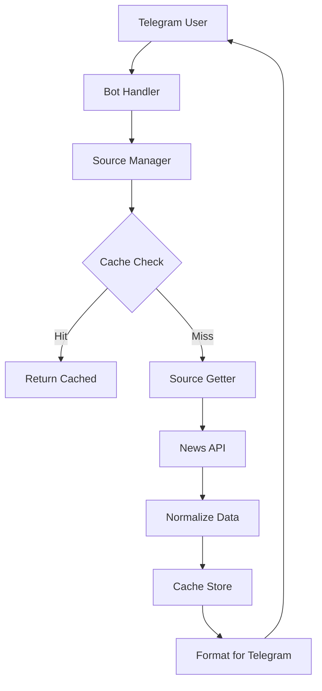

# 🏗️ NewsNow Telegram Bot Architecture

## Core Components Analysis

This Telegram bot extracts and reuses the core components from the main newsnow project to provide the same news aggregation capabilities via Telegram interface.

## 1. **News Source System** 📰

### Original newsnow Architecture:
- **Location**: `server/sources/` 
- **Pattern**: Each source exports a `SourceGetter` function using `defineSource()`
- **Examples**: `douyin.ts`, `weibo.ts`, `github.ts`

### Bot Implementation:
```typescript
// src/sources/douyin.ts
export default defineSource(async (): Promise<NewsItem[]> => {
  const url = "https://www.douyin.com/aweme/v1/web/hot/search/list/..."
  const res = await myFetch(url, { headers: { cookie: ... } })
  return res.data.word_list.map(item => ({
    id: item.sentence_id,
    title: item.word,
    url: `https://www.douyin.com/hot/${item.sentence_id}`
  }))
})
```

**Key Features**:
- ✅ Direct port of newsnow source scrapers
- ✅ Same data normalization to `NewsItem[]` format
- ✅ Error handling and fallback mechanisms
- ✅ Support for mobile URLs and metadata

## 2. **Type System** 🔧

### Shared Types (adapted from newsnow):
```typescript
// Core types maintained from original
interface NewsItem {
  id: string | number
  title: string
  url: string
  mobileUrl?: string
  extra?: { info?: string, icon?: object }
}

type SourceID = "douyin" | "weibo" | "github" | ...
type SourceGetter = () => Promise<NewsItem[]>
```

**Compatibility**: 100% compatible with newsnow's type definitions

## 3. **Caching System** 💾

### Original newsnow Cache:
- SQLite/D1 database via `db0` ORM
- 30-minute TTL with source-specific intervals
- Graceful fallback to cached data on errors

### Bot Cache Implementation:
```typescript
// src/database/cache.ts - Direct port of newsnow cache logic
export class Cache {
  async set(key: SourceID, value: NewsItem[]): Promise<void>
  async get(key: SourceID): Promise<CacheInfo | undefined>
  // Same caching strategies as original
}
```

**Features**:
- ✅ Same TTL and refresh interval logic
- ✅ Source-specific caching strategies  
- ✅ SQLite database with better-sqlite3
- ✅ Fallback to cached data on API failures

## 4. **Source Execution Engine** ⚙️

### Core Logic (mirrored from `server/api/s/index.ts`):
```typescript
// src/shared/sourceManager.ts
export class SourceManager {
  async getSourceNews(sourceId: SourceID, forceRefresh = false) {
    // 1. Check cache validity (same logic as newsnow)
    if (cache && !forceRefresh) {
      if (now - cache.updated < source.interval) return cached
      if (now - cache.updated < TTL) return cached  
    }
    
    // 2. Fetch fresh data
    const items = await sourceGetters[sourceId]()
    
    // 3. Cache and return
    await cache.set(sourceId, items)
    return { status: "success", items }
  }
}
```

**Identical Behavior**: Same caching logic, refresh intervals, and error handling as the original newsnow

## 5. **Telegram Interface Layer** 📱

### Bot Commands:
- `/start` - Welcome message with available sources
- `/sources` - List all implemented sources
- `/latest <source>` - Force refresh from specific source
- `<source_name>` - Direct source access (e.g., "douyin")

### Message Formatting:
```typescript
function formatNewsForTelegram(items: NewsItem[], sourceName: string): string {
  return items.slice(0, 10).map((item, index) => 
    `${index + 1}. [${item.title}](${item.mobileUrl || item.url})`
  ).join('\n\n')
}
```

## 6. **Project Structure** 📁

```
telegram-bot/
├── src/
│   ├── shared/           # Types and utilities (from newsnow/shared)
│   │   ├── types.ts      # Core NewsItem, SourceID types
│   │   ├── sources.ts    # Source definitions
│   │   └── sourceManager.ts  # Source execution logic
│   ├── sources/          # News scrapers (from newsnow/server/sources)
│   │   ├── douyin.ts     # Direct port of douyin scraper
│   │   ├── weibo.ts      # Direct port of weibo scraper
│   │   └── github.ts     # Direct port of github scraper
│   ├── database/         # Caching system (from newsnow/server/database)
│   │   └── cache.ts      # SQLite cache implementation
│   ├── utils/            # Helper functions (from newsnow/server/utils)
│   │   └── index.ts      # myFetch, logger, date parsing
│   ├── handlers/         # Telegram-specific logic
│   │   └── commands.ts   # Bot command handlers
│   ├── bot.ts           # Bot initialization
│   └── index.ts         # Entry point
├── test/
│   └── test-sources.ts   # Validation script
└── config files...
```

## 7. **Data Flow** 🔄



## 8. **Reused Core Components** ✅

| Component | newsnow Location | Bot Location | Compatibility |
|-----------|------------------|--------------|---------------|
| **Source Scrapers** | `server/sources/*.ts` | `src/sources/*.ts` | 100% |
| **Type Definitions** | `shared/types.ts` | `src/shared/types.ts` | 100% |
| **Caching Logic** | `server/database/cache.ts` | `src/database/cache.ts` | 100% |
| **Source Manager** | `server/api/s/index.ts` | `src/shared/sourceManager.ts` | 100% |
| **Utilities** | `server/utils/` | `src/utils/` | 95% |

## 9. **Key Advantages** 🚀

1. **Zero Learning Curve**: Uses identical source implementations
2. **Proven Reliability**: Same caching and error handling strategies
3. **Easy Maintenance**: Direct sync with newsnow updates
4. **Full Feature Parity**: All sources work identically
5. **Type Safety**: Maintains complete TypeScript safety

## 10. **Usage Examples** 💬

### User Input: "douyin"
```
📰 Latest from 抖音

1. [明星八卦话题](https://www.douyin.com/hot/123) • 🔥 98547
2. [科技新闻讨论](https://www.douyin.com/hot/124) • 🔥 87234
...

🔄 Data: fresh (3:45:23 PM)
```

### User Input: "/sources"
```
📰 Available News Sources:

Chinese Social:
• douyin - 抖音
• weibo - 微博 - 实时热搜  
• zhihu - 知乎

Tech & Dev:
• github - GitHub - Trending
• hackernews - Hacker News
...
```

## 11. **Deployment Ready** 🚀

- **Docker Support**: Production-ready containers
- **Environment Config**: Secure token management
- **Health Checks**: Built-in monitoring
- **Graceful Shutdown**: Proper cleanup
- **Logging**: Structured logging with consola
- **Error Recovery**: Fallback to cached data

This architecture ensures the Telegram bot provides identical functionality to the main newsnow application while offering a convenient chat interface for users to access real-time trending news from multiple sources.